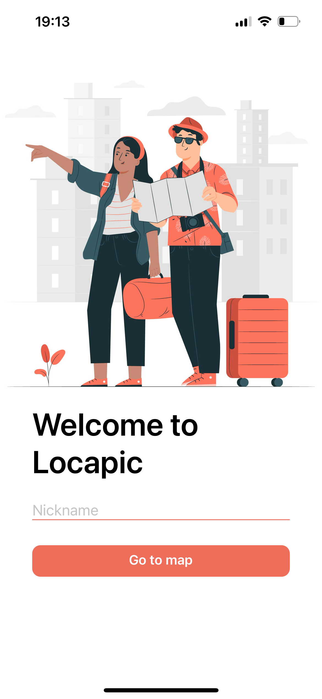
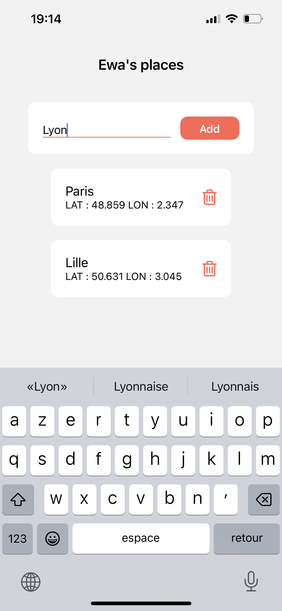

# 📱 Locapic - Frontend

Locapic est une mini application mobile développée avec React Native (Expo). Elle permet à un utilisateur de visualiser sa position actuelle sur une carte, d’ajouter des lieux favoris et de les retrouver facilement.

## ⚙️ Technologies

- React Native (Expo)
- Redux Toolkit
- API REST (via backend Node.js)

## 📸 Aperçu de l'application

